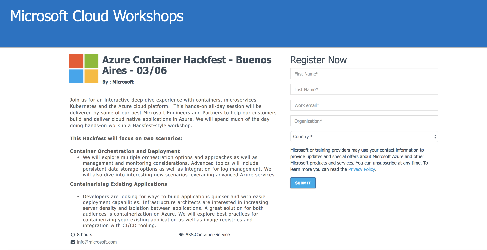
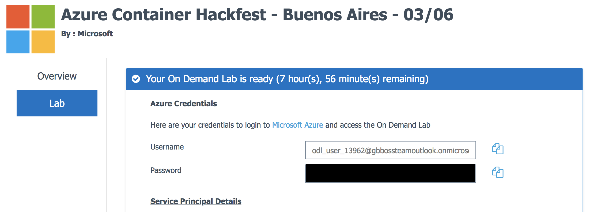

# Lab Environment

## Classroom Setting

These labs are designed for delivery in a classroom setting with the **Azure Global Blackbelt Team.** We typically provide an Azure subscription and a Linux VM (jumpbox) for attendees to complete the labs.

### Getting Registered

* Register for the class with the URL provided by the team (eg - http://aka.ms/something).

    

* On the next page, click the `Launch Lab` button.
* Wait for the lab to be prepared. You will receive **TWO** emails. Wait for the second email and the lab details to appear in the browser. _This can take a few minutes._
* Note the details for your On Demand Lab:
    * Azure Credentials
    * Service Principal Details
    * Environment Details

        

### Setup Environment

* The first two labs will require you to RDP into a Linux jumpbox in the Azure subscription created for you.
    * Ensure you have a proper RDP client on your PC.
    * On the Mac, use Remote Desktop Client in the App Store.
* Setup Azure Cloud Shell: 

    1. Browse to http://portal.azure.com
    2. Login with the Azure credentials that were created in the previous steps (eg - "odl_user_12345@gbbossteamoutlook.onmicrosoft.com")
    3. Click on the cloud shell icon to start your session.

        

    4. Select `Bash (Linux)`
    5. You will be prompted to setup storage for your cloud shell. Click `Show advanced settings`

        

    6. Provide a unique value for Storage account name. This must be all lower case and no punctuation. Use "cloudshell" for File share name. See example below.

        

    7. Click `Create storage`

    > Note: You can also use the dedicated Azure Cloud Shell URL: http://shell.azure.com 

## Self-guided

It is possible to use your own machine outside of the classroom. You will need the following in order to complete these labs: 

* Azure subscription
* Linux, Mac, or Windows with Bash
* Docker
* Azure CLI
* Visual Studio Code
* Helm
* Kubernetes CLI (kubectl)
* MongoDB (only lab #1 requires this)
* GitHub account and git tools
