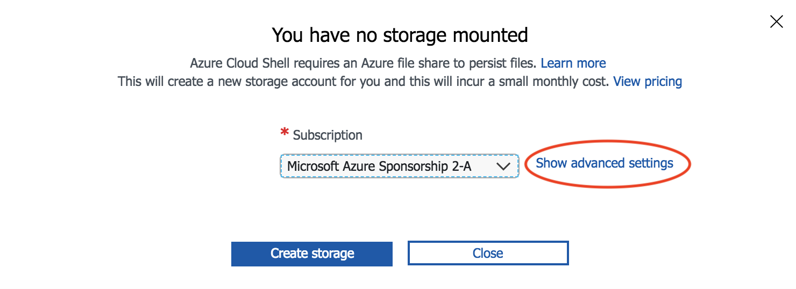
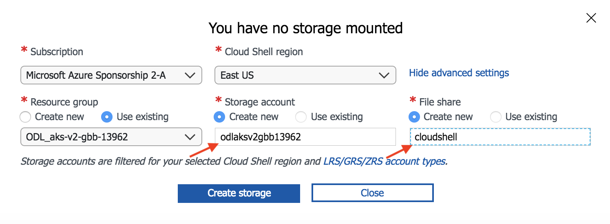

# Lab Environment

## Classroom Setting

These labs are designed for delivery in a classroom. For these labs we require a Linux-based VM in Azure as a "jumpbox". The first task here is to create this virtual machine and install the required software on it.

Our labs are build and verified using CentOS7. Our recommendations is to use CentOS7. 

### Setup Environment

* Setup your Jumpbox VM in Azure
    1. Browse to http://portal.azure.com
    2. Click on "Create a resource" and search for "CentOS"
    3. Deploy a CentOS7.4 VM - please recognize your credentials
    4. Connect to your jumpbox using SSH (PuTTY or MobaXTerm)
    5. Install the required tools and software
    6. tbc..

* Setup Azure Cloud Shell: 

    1. Browse to http://portal.azure.com
    2. Login with the Azure credentials
    3. Click on the cloud shell icon to start your session.

        

    4. Select `Bash (Linux)`
    5. You will be prompted to setup storage for your cloud shell. Click `Show advanced settings`

        

    6. Provide a unique value for Storage account name. This must be all lower case and no punctuation. Use "cloudshell" for File share name. See example below.

        

    7. Click `Create storage`

    > Note: You can also use the dedicated Azure Cloud Shell URL: http://shell.azure.com 
