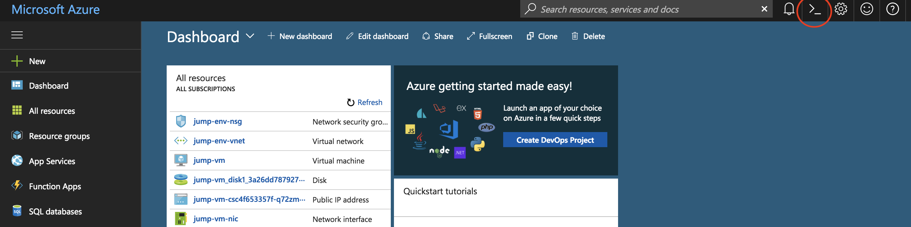

# Dockerizing Applications with Azure Container Registry

## Azure Container Registry (ACR)

We will use Azure COntainer Registry to build our containers from Dockerfiles and also host our images to run in AKS

### Create Azure Container Registry instance

1. In the browser, sign in to the Azure portal at https://portal.azure.com. Your Azure login ID will look something like `odl_user_9294@gbbossteamoutlook.onmicrosoft.com`
2. Click "Create a resource" and select "Container Registry"
3. Provide a name for your registry (this must be unique)
4. Use the existing Resource Group
5. Enable the Admin user
6. Use the 'Standard' SKU (default)

    > The Standard registry offers the same capabilities as Basic, but with increased storage limits and image throughput. Standard registries should satisfy the needs of most production scenarios.

1. Open the Azure Cloud Shell

    

2. The first time Cloud Shell is started will require you to create a storage account. In our lab, you must click `Advanced` and enter an account name and share.

3. Once your cloud shell is started, clone the workshop repo into the cloud shell environment
    ```
    git clone https://github.com/Azure/blackbelt-aks-hackfest.git
    ```

4. In the cloud shell, you are automatically logged into your Azure subscription. ```az login``` is not required.
    
5. Verify your subscription is correctly selected as the default
    ```
    az account list
    ```

6. Find your RG name

    ```
    az group list 
    ```
    
    ```

    [
    {
        "id": "/subscriptions/b23accae-e655-44e6-a08d-85fb5f1bb854/resourceGroups/ODL-aks-v2-gbb-8386",
        "location": "centralus",
        "managedBy": null,
        "name": "ODL-aks-v2-gbb-8386",
        "properties": {
        "provisioningState": "Succeeded"
        },
        "tags": {
        "AttendeeId": "8391",
        "LaunchId": "486",
        "LaunchType": "ODL",
        "TemplateId": "1153"
        }
    }
    ]

    # copy the name from the results above and set to a variable 
    
    RG_NAME=

For the first container, we will be creating a Dockerfile from scratch. For the other containers, the Dockerfiles are provided.

### Web Container

1. Create a Dockerfile

    * Access the cloud shell
    * In the `~/blackbelt-aks-hackfest/app/web` directory, add a file called "Dockerfile"
        * you can launch in in-browser code editor in cloud shell by typing `code .` at the bash prompt

    * Add the following lines and save:

        ```
        FROM node:9.4.0-alpine

        ARG VCS_REF
        ARG BUILD_DATE
        ARG IMAGE_TAG_REF

        ENV GIT_SHA $VCS_REF
        ENV IMAGE_BUILD_DATE $BUILD_DATE
        ENV IMAGE_TAG $IMAGE_TAG_REF

        WORKDIR /usr/src/app
        COPY package*.json ./
        RUN npm install

        COPY . .
        RUN apk --no-cache add curl
        EXPOSE 8080

        CMD [ "npm", "run", "container" ]
        ```

2. Create a container image for the node.js Web app

    From the terminal session: 

    ```
    cd ~/blackbelt-aks-hackfest/app/web
    
    # Set environment variable for ACR Name
    ACR_NAME=<registry-name>
    az acr build --registry $ACR_NAME --build-arg BUILD_DATE=`date -u +"%Y-%m-%dT%H:%M:%SZ"` --build-arg VCS_REF=`git rev-parse --short HEAD` --build-arg IMAGE_TAG_REF=v1 --image rating-web:v1 .
    
    ```
    1. Return to the Azure Portal in your browser and validate that the image appears in your Container Registry under the "Repositories" area.
    2. Under tags, you will see "v1" listed.

### API Container

In this step, the Dockerfile has been created for you. 

1. Create a container image for the node.js API app

    ```
    cd ~/blackbelt-aks-hackfest/app/api

   az acr build --registry $ACR_NAME --image rating-api:v1 .
    
    ```
    1. Return to the Azure Portal in your browser and validate that the image appears in your Container Registry under the "Repositories" area.
    2. Under tags, you will see "v1" listed.


### MongoDB Container

1. Create a MongoDB image with data files

    ```
    cd ~/blackbelt-aks-hackfest/app/db

    az acr build --registry $ACR_NAME --image rating-api:v1 .
    
    ```
    1. Return to the Azure Portal in your browser and validate that the image appears in your Container Registry under the "Repositories" area.
    2. Under tags, you will see "v1" listed.


