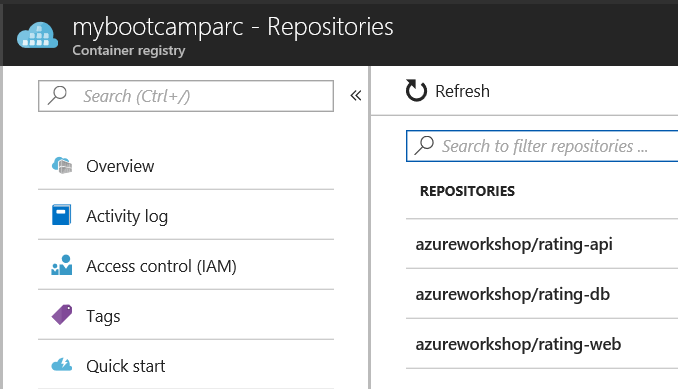

# Dockerizing Applications

 **Activities in this lab needs to be performed in the Linux Jumpbox Machine**

## Build Container Images

For the first container, we will be creating a Dockerfile from scratch. For the other containers, the Dockerfiles are provided.

### Web Container

1. Create a Dockerfile

    * Access the jumpbox
    * In the `~/blackbelt-aks-hackfest/app/web` directory, add a file called "Dockerfile"
        * If you are in an SSH session, use vi as the editor

    * Add the following lines and save:

        ```
        FROM node:9.4.0-alpine

        ARG VCS_REF
        ARG BUILD_DATE
        ARG IMAGE_TAG_REF

        ENV GIT_SHA $VCS_REF
        ENV IMAGE_BUILD_DATE $BUILD_DATE
        ENV IMAGE_TAG $IMAGE_TAG_REF

        WORKDIR /usr/src/app
        COPY package*.json ./
        RUN npm install

        COPY . .
        RUN apk --no-cache add curl
        EXPOSE 8080

        CMD [ "npm", "run", "container" ]
        ```

2. Create a container image for the node.js Web app

    From the terminal session: 

    ```
    cd ~/blackbelt-aks-hackfest/app/web
    
    docker build --build-arg BUILD_DATE=`date -u +"%Y-%m-%dT%H:%M:%SZ"` --build-arg VCS_REF=`git rev-parse --short HEAD` --build-arg IMAGE_TAG_REF=v1 -t rating-web .
    ```
    **You can ignore the NPM warnings generated while the image is being built.**

   **If you have an error regarding "Unable to evaluate symlinks, No such file or directory". Ensure the file name is correct including case-sensitivity**

3. Once the above command is completed, validate that the image was created with command: `docker images`
   ```
   docker images
   
   REPOSITORY               TAG                 IMAGE ID            CREATED             SIZE
   rating-web               latest              259aa85bc386        31 minutes ago      212MB
   ```

### API Container

In this step, the Dockerfile has been created for you. 

1. Create a container image for the node.js API app

    ```
    cd ~/blackbelt-aks-hackfest/app/api

    docker build -t rating-api .
    ```

2. Validate image was created with `docker images`

    ```
    sudo docker images
    
    REPOSITORY          TAG               IMAGE ID            CREATED             SIZE
    rating-api          latest            eb53c9e08676        13 seconds ago      84.8 MB
    ```

### MongoDB Container

1. Create a MongoDB image with data files

    ```
    cd ~/blackbelt-aks-hackfest/app/db

    docker build -t rating-db .
    ```

2. Validate image was created with `docker images`

    ```
    sudo docker images
    
    REPOSITORY          TAG                 IMAGE ID            CREATED             SIZE
    rating-db           latest              d099239ef16f        15 seconds ago      366 MB
    ```

## Run Containers

### Setup Docker Network

Create a docker bridge network to allow the containers to communicate internally. 

```
docker network create --subnet=172.18.0.0/16 my-network
```

### MongoDB Container

1. Run mongo container

    ```
    docker run -d --name db --net my-network --ip 172.18.0.10 -p 27017:27017 rating-db
    ```

2. Validate by running `docker ps -a`

3. Import data into database

    ```
    docker exec -it db bash
    ```

    You will have a prompt inside the mongo container. From that prompt, run the import script (`./import.sh`)

    ```
    root@61f9894538d0:/# ./import.sh
    2018-01-10T19:26:07.746+0000	connected to: localhost
    2018-01-10T19:26:07.761+0000	imported 4 documents
    2018-01-10T19:26:07.776+0000	connected to: localhost
    2018-01-10T19:26:07.787+0000	imported 72 documents
    2018-01-10T19:26:07.746+0000	connected to: localhost
    2018-01-10T19:26:07.761+0000	imported 2 documents
    ```

4. Type `exit` to exit out of container

### API Container

1. Run api app container

    ```
    docker run -d --name api -e "MONGODB_URI=mongodb://172.18.0.10:27017/webratings" --net my-network --ip 172.18.0.11 -p 3000:3000 rating-api
    ```

    > Note that environment variables are used here to direct the api app to mongo.

2. Validate by running `docker ps -a`

3. Test api app with curl
    ```
    curl http://localhost:3000/api/heroes
    ```

### Web Container

1. Run web app container

    ```
    docker run -d --name web -e "API=http://172.18.0.11:3000/" --net my-network --ip 172.18.0.12 -p 8080:8080 rating-web
    ```

2. Validate by running `docker ps -a`

3. Test web app
    
    The jumpbox has a Public IP address and port 8080 is open. You can browse your running app with a link such as: http://13.90.246.114:8080 

    You can also test via curl
    ```
    curl http://localhost:8080
    ```

## Azure Container Registry (ACR)

Now that we have container images for our application components, we need to store them in a secure, central location. In this lab we will use Azure Container Registry for this.

### Create Azure Container Registry instance

1. In the browser, sign in to the Azure portal at https://portal.azure.com. 
2. Click "Create a resource" and select "Container Registry"
3. Provide a name for your registry (this must be unique)
4. Use the existing Resource Group
5. Enable the **Admin user**
6. Use the 'Standard' SKU (default)

    > The Standard registry offers the same capabilities as Basic, but with increased storage limits and image throughput. Standard registries should satisfy the needs of most production scenarios.

### Login to your ACR with Docker

1. Browse to your Container Registry in the Azure Portal
2. Click on "Access keys"
3. Make note of the "Login server", "Username", and "password"
4. In the terminal session on the jumpbox, set each value to a variable as shown below

    ```
    # set these values to yours
    ACR_SERVER=
    ACR_USER=
    ACR_PWD=

    docker login --username $ACR_USER --password $ACR_PWD $ACR_SERVER
    ```

### Tag images with ACR server and repository 

```
# Be sure to replace the login server value

docker tag rating-db $ACR_SERVER/azureworkshop/rating-db:v1
docker tag rating-api $ACR_SERVER/azureworkshop/rating-api:v1
docker tag rating-web $ACR_SERVER/azureworkshop/rating-web:v1
```

### Push images to registry

```
docker push $ACR_SERVER/azureworkshop/rating-db:v1
docker push $ACR_SERVER/azureworkshop/rating-api:v1
docker push $ACR_SERVER/azureworkshop/rating-web:v1
```

Output from a successful `docker push` command is similar to:

```
The push refers to a repository [mycontainerregistry.azurecr.io/azureworkshop/rating-db]
035c23fa7393: Pushed
9c2d2977a0f4: Pushed
d7b18f71e002: Pushed
ec41608c0258: Pushed
ea882d709aca: Pushed
74bae5e77d80: Pushed
9cc75948c0bd: Pushed
fc8be3acfc2d: Pushed
f2749fe0b821: Pushed
ddad740d98a1: Pushed
eb228bcf2537: Pushed
dbc5f877c367: Pushed
cfce7a8ae632: Pushed
v1: digest: sha256:f84eba148dfe244f8f8ad0d4ea57ebf82b6ff41f27a903cbb7e3fbe377bb290a size: 3028
```

### Validate images in Azure

1. Return to the Azure Portal in your browser and validate that the images appear in your Container Registry under the "Repositories" area.



2. Click on the Repository name and under 'tags' section, you will see "v1" listed.
