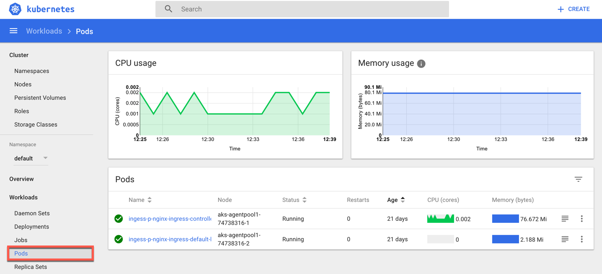

# Kubernetes Dashboard

The Kubernetes dashboard is a web ui that lets you view, monitor, and troubleshoot Kubernetes resources. 

> Note: The Kubernetes dashboard is a secured endpoint and can only be accessed using the SSH keys for the cluster. Since cloud shell runs in the browser, it is not possible to tunnel to the dashboard using the steps below.

### Accessing The Dashboard UI

There are multiple ways of accessing Kubernetes dashboard. You can access through kubectl command-line interface or through the master server API. We'll be using 'az aks browse' command, as it provides a secure connection, that doesn't expose the UI to the internet.

 Commands in this lab excercise needs to be run from a PowerShell session in your Local Computer ([azure cli](https://docs.microsoft.com/en-us/cli/azure/install-azure-cli-windows?view=azure-cli-latest) requires to be installed in the Local Computer). 

1. Command-Line Proxy

    * From your local computer, open a local command prompt or Powershell with elevated privileges
    * Run ```az login``` to authenticate with Azure
    * Run ```az group list -o table``` to lookup the resource group containing your cluster
    * Run ```az aks list -o table``` to lookup the name of your AKS cluster
    * Run ```az aks get-credentials -n CLUSTER_NAME -g RGNAME``` in order to get the credentials to access our managed Kubernetes cluster in Azure. Replace CLUSTER_NAME with your AKS Cluster name and RGNAME with the name of your resource group.
    * Run ``` az aks install-cli``` to install kubectl, the Kubernetes command-line tool. Add the path where the kubectl got installed to the PATH variable in your local machine and restart the powershell/command prompt session, so that you can run the kubectl command from any location in the local machine. 
    * Run ```az aks browse -n CLUSTER_NAME -g RGNAME```
    * This creates a local proxy to 127.0.0.1:8001
    * Open a web browser (e.g. Firefox) and point to: <http://127.0.0.1:8001/>

### Explore Kubernetes Dashboard

1. In the Kubernetes Dashboard select nodes to view

2. Explore the different node properties available through the dashboard
3. Explore the different pod properties available through the dashboard 
4. In this lab, feel free to take a look around other resources Kubernetes provides through the dashboard.

> To learn more about Kubernetes objects and resources, browse the documentation: <https://kubernetes.io/docs/user-journeys/users/application-developer/foundational/#section-3>
