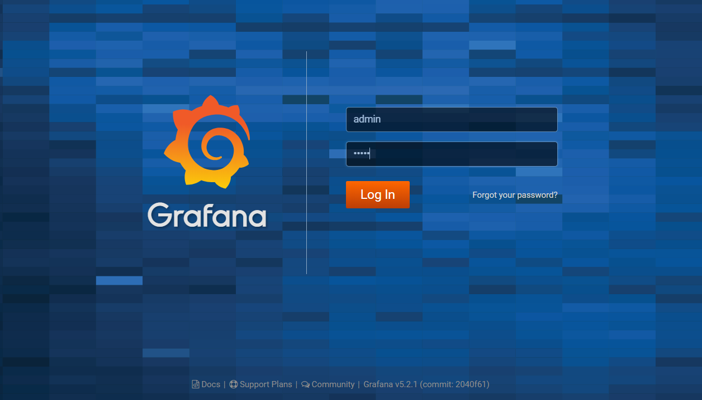
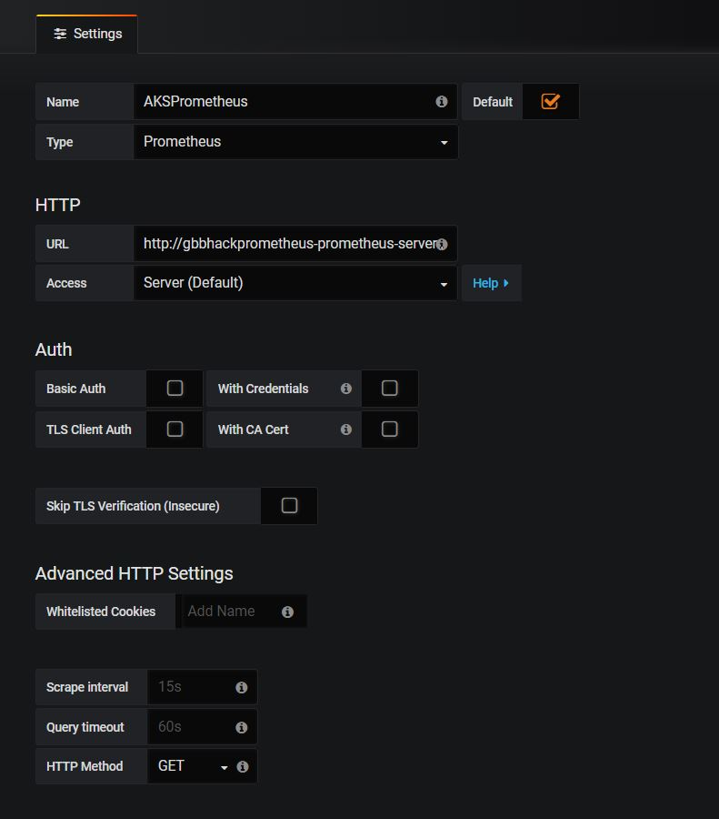
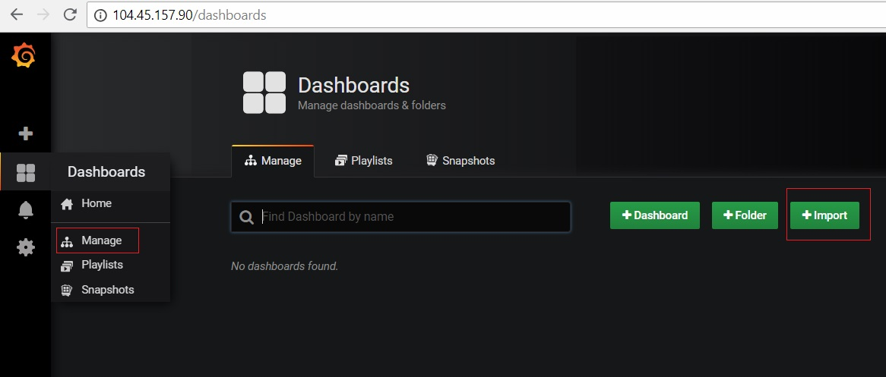
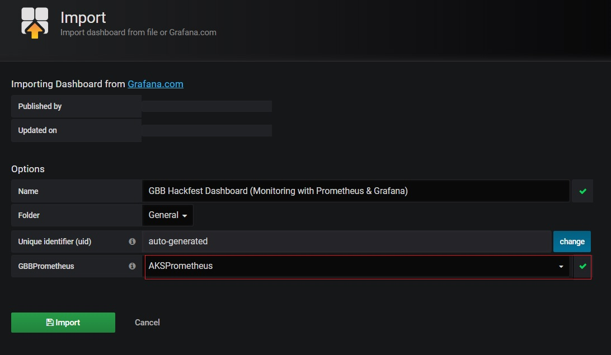

# Add Monitoring to an Azure Kubernetes Service Cluster
There are a number of monitoring solutions available today. Here is a quick, but not exhaustive list for reference purposes:
* Datadog
* Sysdig
* Elastic Stack
* Splunk
* Operations Management Suite
* Prometheus
 
For the purposes of this lab we will be focusing in on Prometheus and using Grafana to provide a visual Dashboard of our Azure Kubernetes Service Cluster.
## Install Helm
We are going to be installing Prometheus and Grafana into our K8s cluster using Helm and Tiller. You can think of Helm as a package manager for Kubernetes with Tiller being the server-side component.
 **Proceed with below steps in Jumpbox**
1. In the Azure Cloud Shell and in the Jumpbox, the Helm CLI is already installed. 
2. Initialize Helm
```
helm init
``` 
3. Validate Helm and Tiller were installed successfully
```
helm version
# You should see something like the following as output:
Client: &version.Version{SemVer:"v2.9.1", GitCommit:"8478fb4fc723885b155c924d1c8c410b7a9444e6", GitTreeState:"clean"}
Server: &version.Version{SemVer:"v2.9.1", GitCommit:"8478fb4fc723885b155c924d1c8c410b7a9444e6", GitTreeState:"clean"}
```
**Note:** If you are receiving an error saying "*Error: could not find a ready tiller pod*", run the command "**helm init --force-upgrade**" to forcefully initiate HELM and check the HELM version again.

4. If the cluster is RBAC enabled, tiller Pod would not have enough permission in the default namespace. To fix this we need to create a ClusterRole, ClusterRoleBinding and a Service Account. With this we can give necessary permission to Tiller
```
kubectl create serviceaccount --namespace kube-system tiller
kubectl create clusterrolebinding tiller-cluster-rule --clusterrole=cluster-admin --serviceaccount=kube-system:tiller
kubectl patch deploy --namespace kube-system tiller-deploy -p '{"spec":{"template":{"spec":{"serviceAccount":"tiller"}}}}'
```
## Install Prometheus using Helm
Prometheus is a Cloud Native Computing Foundation (CNCF) project used to collect and process metrics. It collects metrics from configured targets, in our case it is a Kubernetes Cluster.
1. Install Prometheus using Helm CLI
Switch to the `helper-files` directory and view the `prometheus-configforhelm.yaml` file. This configures Helm to install Prometheus with our desired settings. **Set RBAC create to true in the yaml file** for rbac enabled clusters. This will ensure related service accounts and cluster/role bindings are created for Prometheus.
```
cd ~/blackbelt-aks-hackfest/labs/helper-files
# The following command will install Prometheus into the K8s cluster using custom settings
helm install --name gbbhackprometheus stable/prometheus --version 4.6.13 -f prometheus-configforhelm.yaml --namespace logging
```
2. Validate that Prometheus was Installed
``` 
kubectl get pods -n logging | grep prometheus
# You should see something like the following as output:
gbbhackprometheus-prometheus-kube-state-metrics-5b9f4d9d9-vctrx 1/1 Running 0 3m
gbbhackprometheus-prometheus-node-exporter-v6frn 1/1 Running 0 3m
gbbhackprometheus-prometheus-server-54f5bcb797-sbzsp 2/2 Running 0 3m
```
```
kubectl get svc -n logging | grep prometheus
# You should see something like the following as output:
gbbhackprometheus-prometheus-kube-state-metrics ClusterIP None <none> 80/TCP 3m
gbbhackprometheus-prometheus-node-exporter ClusterIP None <none> 9100/TCP 3m
gbbhackprometheus-prometheus-server LoadBalancer 10.0.212.145 52.168.100.25 9090:32340/TCP 3m
```
## Install Grafana
Grafana is a dashboard visualization tool that can use all kinds of data sources. In our case, Prometheus will be used as the data source.
1. Install Grafana using Helm CLI
The following command will install Grafana into the K8s cluster with a few custom settings to make it easier to access.
* We are setting the default username and password to **admin** to make it easier to remember
* We are also setting the service type to **LoadBalancer** to expose the service outside of the cluster and make it accessible via the Internet
```
helm install --name gbbhackgrafana stable/grafana --version 0.5.1 --set server.service.type=LoadBalancer,server.adminUser=admin,server.adminPassword=admin,server.image=grafana/grafana:latest,server.persistentVolume.enabled=false --namespace logging
```
2. Validate that Grafana was Installed
```
kubectl get pods -n logging | grep grafana
# You should see something like the following as output:
gbbhackgrafana-grafana-66f7fd5cb8-qbbqs 1/1 Running 0 2h
```
```
kubectl get svc 
# You should see something like the following as output, take note of the **EXTERNAL-IP column**:
gbbhackgrafana-grafana LoadBalancer 10.0.163.226 "52.226.75.38" 80:31476/TCP 2h
```
3. Test Grafana UI Comes Up
Use the EXTERNAL-IP value from the previous step and put that into your browser:
* **eg**: http://52.226.75.38, EXTERNAL-IP column from above. You should see something like the following come up, be patient it will take one or two minutes:

## Setting up Grafana
1. Log into Grafana Dashboard using **admin** for both the username and password
* You will be prompted to provide a new password.
* You should see something like the following in the Home Page:

2. Add Prometheus as a Data Source
* If you recall from above, we exposed a number of K8s services, one of those services was the Prometheus Server. We are going to use that Service endpoint in our Data Service configuration. 
Click on the 'Add Data Source' button and the screen should look something like the below screen shot.

* Use `http://gbbhackprometheus-prometheus-server:9090` for the URL in the HTTP settings.

3. Validate Prometheus Data Source
* Once you have filled in the values similar to the screenshot above, click the **Save & Test** button and ensure no errors come back.
4. Add K8s Monitoring Dashboard to Grafana
* After the datasource has been added, it is now time to add a dashboard. Grafana dashboards can be shared on Grafana.com. Go to **manage** dashboards via the menu in the top left and click on **Import** option.

* You can click on the Upload File button and browse to the `grafana-dashboard.json` in the `helper-files` directory. Since we don't have the helper-files downloaded locally you can paste the contents of the **'grafana-dashboard.json'** (https://raw.githubusercontent.com/heoelri/container-bootcamp/master/labs/helper-files/grafana-dashboard.json) file from the '/lab/helper-files' directory of this github repository into the JSON text box. Click on **Load**

* Set the datasource dropdown to the **AKSPrometheus** that was created in the previous step. 

* Click the **Import** button.

You should now have Prometheus and Grafana running in your Azure Kubernetes Service cluster and be able to see the Grafana Dashboard.
Explore the Grafana dashboard to see different performance and usage metrics of your AKS cluster.
