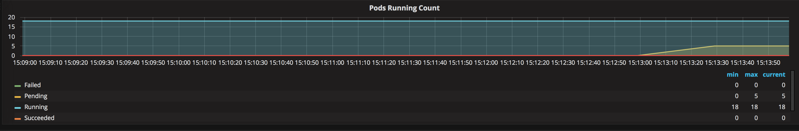

# Working with Azure Kubernetes Service Cluster Scaling

Imagine a scenario where you realize that your existing cluster is at capacity and you need to scale it out by adding more nodes in order to increase capacity and to be able to deploy more PODS.

 **Perform below steps in the Azure Cloud Shell**

## Scale Application
1. Check to see current number of pods running via Grafana Dashboard.
Go to the same Grafana Dashboard from [lab 6](/labs/day1-labs/06-monitoring-k8s.md) and look at the **Pods Running Count** section. You will see the total count of Pods and the various phases they are in.


2. Check the current number of heroes pods running:
```bash
kubectl get pods | grep heroes
```

You should see something like the following as output (one replica of each pod):
```console
heroes-api-deploy-1165643395-fwjtm             1/1       Running   0          2d
heroes-db-deploy-839157328-4656j               1/1       Running   0          2d
heroes-web-1677855039-8t57k                    1/1       Running   0          2d
```
3. Scale out the Web application
To simulate a real-world scenario we are going to scale the web app to handle increased load.
```bash
# This command will create multiple replicas of the heroes-web pod to simulate additional load on the cluster.
kubectl scale deploy/heroes-web-deploy --replicas=8
```
4. Check to see number of pods now running via Grafana Dashboard


5. Check to see number of heroes pods running via kubectl
```bash
kubectl get pod | grep heroes
```
You should see something like the following as output (more than one heroes-web pod and some of them in different states):
```console
NAME                                                              READY     STATUS    RESTARTS   AGE
heroes-web-3683626428-4m1v4                                       0/1       Pending   0          2m
heroes-web-3683626428-hcs49                                       1/1       Running   0          4m
heroes-web-3683626428-z1t1j                                       0/1       Pending   0          2m
heroes-web-3683626428-zxp2s                                       1/1       Running   0          2m
```

6. Check up on Pods Running in Grafana dashboard
As you can see we have a number of pods that are in the pending state which means they are trying to be scheduled to run. In this scenario the cluster is out of capacity so they are not able to be scheduled.




## Scale K8s Cluster
1. Check to see number of current nodes running.
```bash
kubectl get nodes
```

You should see something like the following as output (there is one node in the cluster):
```console
NAME                       STATUS    ROLES     AGE       VERSION
aks-nodepool1-42552728-0   Ready     agent     4h        v1.10.6
aks-nodepool1-42552728-1   Ready     agent     4h        v1.10.6
```

2. Scale out AKS cluster to accommodate the demand
```bash
# set these value for Resource Group Name (the cluster and the RG are the same name)

az aks scale --resource-group <RESOURCE_GROUP_NAME> --name <AKS_CLUSTER_NAME> --node-count 4
```

> Note this may take some time. Good time to get some coffee. 

3. Check to see if the new nodes are deployed and "Ready"
```bash
kubectl get nodes
```

You should see something like the following as output (there are now 4 nodes in the cluster):
```console
NAME                       STATUS    ROLES     AGE       VERSION
aks-nodepool1-42552728-0   Ready     agent     5h        v1.9.6
aks-nodepool1-42552728-1   Ready     agent     5h        v1.9.6
aks-nodepool1-42552728-2   Ready     agent     7m        v1.9.6
aks-nodepool1-42552728-3   Ready     agent     7m        v1.9.6
```

4. Re-visit Grafana Dasboard to validate cluster scale is working.
Take a look at the **Pods Pending Count** again and you should see that after a few minutes the number of pending pods is going down.


You now have additional node capacity in your Azure Kubernetes Service cluster to be able to provision more pods.

# AKS Autoscaler (optional)
Since early 2019 Azure Kubernetes Service (AKS) supports autoscaling (in preview). Autoscaling allows your AKS cluster to automatically add or remove nodes based on it's current utilization. It can be enabled during cluster creation or afterwards for an existing cluster.

To enable autoscaling in your existing environment you have to make sure that we have the following things in place:

1. Azure CLI version 2.0.55 or later. Run `az --version` to find the version. #
2. Kubernetes version 1.12.4 (have a look on [Lab 10 - Upgrade AKS](labs/day1-labs/10-cluster-upgrading.md))
3. aks-preview Azure CLI extension installed

```bash
az extension add --name aks-preview
```

When all these prerequisites are in place use the following command to enable autoscaling for your cluster with between 1 and 4 nodes.

```bash
az aks update \
  --resource-group <RESOURCE_GROUP_NAME> \
  --name <AKS_CLUSTER_NAME> \
  --enable-cluster-autoscaler \
  --min-count 1 \
  --max-count 4
```

For more about Autoscaling in AKS have a look on: [Automatically scale a cluster to meet application demands on Azure Kubernetes Service (AKS)](https://docs.microsoft.com/en-us/azure/aks/cluster-autoscaler)


   ##### [Return back to BootCamp Table of Contents (Main Page)](/README.md)