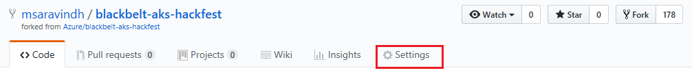
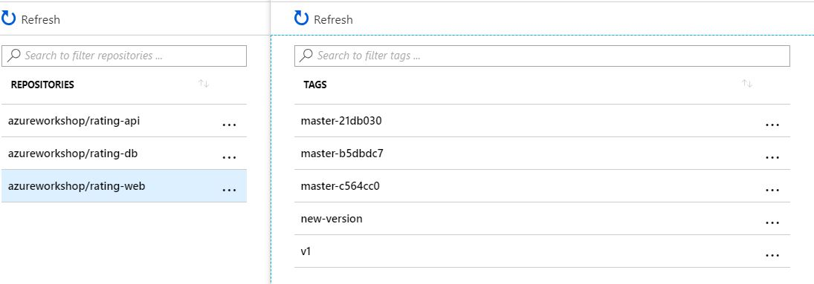

# CI/CD with Brigade

In this lab, we will use Brigade >=0.11.0 to automate build and delivery of the web application into our AKS cluster. 

Learn more about Brigade here: http://brigade.sh 

> Note. We chose to use Brigade here, but other tools such as Jenkins can perform the same functions.

## Pre-requisites

This lab has pre-requisites. Some have been completed in prior labs.

* Container images created and pushed to Azure Container Registry (Lab #2)
* AKS cluster deployed (Lab #3)
* Deployed the web, api, and database components (Lab #4)
* Helm is required. Check to see if Helm is working: 

    ```
    helm version

    Client: &version.Version{SemVer:"v2.7.2", GitCommit:"8478fb4fc723885b155c924d1c8c410b7a9444e6", GitTreeState:"clean"}
    Server: &version.Version{SemVer:"v2.7.2", GitCommit:"8478fb4fc723885b155c924d1c8c410b7a9444e6", GitTreeState:"clean"}
    ```

* Github account. If you already have one, you can use it here. Otherwise, go to https://github.com/join to create one. For the instructions below, I will be using https://github.com/thedude-lebowski as a sample.

## Install Brigade

 **Perform below steps in the Jumpbox**

1. Update helm repo

    ```
    helm repo add brigade https://azure.github.io/brigade
    ```

2. Install brigade chart

    ```
    helm install -n brigade brigade/brigade --set rbac.Enabled=true

    # Note that if you are using kubernetes pre-1.8, you will need to run:
    
    helm install -n brigade brigade/brigade --set vacuum.enabled=false

    # you should see 3 new pods

    odl_user@Azure:~$ kubectl get pod | grep brigade
    brigade-brigade-api-884998b78-h4qt5     1/1       Running   0          41s
    brigade-brigade-ctrl-576bc44775-g9nht   1/1       Running   0          41s
    brigade-brigade-gw-84c5dbf7f9-hfzqq     1/1       Running   0          41s
    ```

## Fork Github Repo

1. Open Github and login with your account
2. Browse to https://github.com/Azure/blackbelt-aks-hackfest 
3. Click `Fork` to copy the repository into your account

    

## Setup Brigade Project

1. Create a brigade project YAML file in the CentOS VM 

    * Create a file called ```brig-proj-heroes.yaml```
    * Add the contents below to start your file

        ```yaml
        project: "REPLACE"
        repository: "REPLACE"
        cloneURL: "REPLACE"
        sharedSecret: "create-something-super-secret"
        # MAKE SURE YOU CHANGE THIS. It's basically a password
        github:
          token: "REPLACE"
        secrets:
          acrServer: REPLACE
          acrUsername: REPLACE
          acrPassword: "REPLACE"
        vcsSidecar: "deis/git-sidecar:v0.15.0"
        ```

    * Edit the values from above to match your Github account (example below)
        * project: thedude-lebowski/blackbelt-aks-hackfest
        * repository: github.com/thedude-lebowski/blackbelt-aks-hackfest
        * cloneURL: https://github.com/thedude-lebowski/blackbelt-aks-hackfest.git

    * Create a Github token and update the ```brig-proj-heroes.yaml```
        * In your Github, click on `Settings` option under your Profile Menu and click on `Developer settings`
        * Select `Personal sccess tokens`
        * Select `Generate new token`
            
        * Provide a description and give access to the `repo` and then select Generate Token. Make a note of the token
            

        > Note: More details on Brigade and Github integration are here: https://github.com/Azure/brigade/blob/master/docs/topics/github.md 

    * Gather your ACR credentials from the Azure portal. Edit the ```brig-proj-heroes.yaml``` for these values
        * acrServer
        * acrUsername
        * acrPassword

    * After the above steps, your file will look like the below. **sharedSecret** can be any super secret value (values are not valid for real). Once you are done with all the changes save the file.

        ```yaml
        project: "thedude-lebowski/blackbelt-aks-hackfest"
        repository: "github.com/thedude-lebowski/blackbelt-aks-hackfest"
        cloneURL: "https://github.com/thedude-lebowski/blackbelt-aks-hackfest.git"
        sharedSecret: "create-something-super-secret"
        # MAKE SURE YOU CHANGE THIS. It's basically a password
        github:
          token: "58df6bf1c6bogus73d2e76b54531c35f45dfe66c"
        secrets:
          acrServer: youracr.azurecr.io
          acrUsername: youracr
          acrPassword: "lGsP/UA1Gnbogus9Ps5fAL6CeWsGfPCg"
        vcsSidecar: "deis/git-sidecar:v0.15.0"
        ```

2. Create your brigade project

    ```
    # from the directory where your file from step #1 was created

    helm install --name brig-proj-heroes brigade/brigade-project -f brig-proj-heroes.yaml --set rbac.enabled=true
    ``` 

    > Note: There is a ```brig``` CLI client that allows you to view your brigade projects. More details here: <https://github.com/Azure/brigade/tree/master/brig>
    
 3. Create Cluster role binding for brigade worker, api and github-gw service accounts to provide it with enough permissions in the default namespace
 
    ```bash
    kubectl create clusterrolebinding brigade-worker --clusterrole=cluster-admin --serviceaccount=default:brigade-worker
    kubectl create clusterrolebinding brigade-api --clusterrole=cluster-admin --serviceaccount=default:brigade-api
    kubectl create clusterrolebinding brigade-github-gw --clusterrole=cluster-admin --serviceaccount=default:brigade-github-gw
    ```

## Setup Brigade Pipeline

1. In your forked Github repo, add a file called ```brigade.js```
2. Paste the contents from the sample [brigade.js](../helper-files/brigade.js) file in this file
3. Edit `brigade.js` to ensure that the image matches your ACR service name (line 63)

    ```
    function kubeJobRunner (config, k) {
        k.storage.enabled = false
        k.image = "lachlanevenson/k8s-kubectl:v1.8.2"
        k.tasks = [
            `kubectl set image deployment/heroes-web-deploy heroes-web-cntnr=<youracrhere>.azurecr.io/azureworkshop/rating-web:${config.get("imageTag")}`
        ]
    }
    ```
4. Commit the new file
5. Review the steps in the javascript that run the jobs in our pipeline

## Add Dockerfile for web app

In our earlier labs, we had to create a Dockerfile for the web app. Since you forked the repo, we have to do this again.

* In the `~/blackbelt-aks-hackfest/app/web` directory, in Github, add a file called "Dockerfile"
* Add the following lines and save (this will be used by Brigade later)

    ```
    FROM node:9.4.0-alpine

    ARG VCS_REF
    ARG BUILD_DATE
    ARG IMAGE_TAG_REF

    ENV GIT_SHA $VCS_REF
    ENV IMAGE_BUILD_DATE $BUILD_DATE
    ENV IMAGE_TAG $IMAGE_TAG_REF

    WORKDIR /usr/src/app
    COPY package*.json ./
    RUN npm install

    COPY . .
    RUN apk --no-cache add curl
    EXPOSE 8080

    CMD [ "npm", "run", "container" ]
    ```

## Configure Github Webhook

1. Get a URL for your Brigade Gateway

    ```
    kubectl get service brigade-brigade-github-gw

    NAME                 TYPE           CLUSTER-IP    EXTERNAL-IP     PORT(S)          AGE
    brigade-brigade-gw   LoadBalancer   10.0.45.233   13.67.129.228   7744:30176/TCP   4h
    ```

    Use the IP address above to note a URL such as: http://13.67.129.228:7744/events/github You will use this in the next step

2. In your forked Github repo, click on Settings

   

3. Click Webhooks
4. Click `Add webhook`
5. Set the `Payload URL` to the URL created in step 1
6. Set the `Content type` to `application/json`
7. Set the `Secret` to the value from your `brig-proj-heroes.yaml` called "sharedSecret"
8. Set the `Which events...` to `Let me select individual events` and check `Pushes` and `Pull requests`

    

9. Click the `Add webhook` button

## Test the CI/CD Pipeline

1. Update the web application. Directly in your forked Github repo, edit the `Footer.vue` file. Stored in: `blackbelt-aks-hackfest/app/web/src/components/`
2. Find the snippet below *(line 17)* and change the text _"Azure Global Blackbelt Team"_ to your name or whatever you would like to display.

    ```
    <div class="row at-row flex-center flex-middle">
      <div class="col-lg-6">
      </div>
      <div class="col-lg-12 credits">
        Azure Global Blackbelt Team
      </div>
      <div class="col-lg-6">
      </div>
    </div>
    ```

3. Click `Commit changes` in Github. Provide a commit message if you would like.
    
4. List the pods in the cluster (`kubectl get pods`). You should see **Brigade worker pods (brigade-worker-xxxxxx)** and  **jobs pods (job-runner-docker-xxxxxx and job-runner-k8s-xxxxxxxxx)** running.
   The brigade-worker pod loads the brigade.js file and performs the tasks listed in the java script file. It creates the job-runner-docker pod and job-runner-k8s pod based on definitions available in the brigade.js file. 
   
   The **job-runner-docker** pod builds the new rating-web image and pushes it to ACR. 
   You should see a new image created in ACR in the rating-web repository with tag **master-xxxxx** as seen below

    
   
   Since a new version of the image is available in ACR the kubernetes deployment for **heroes-web** needs to be updated.
   
   The **job-runner-k8s** pod updates the image tag for the deployment **heroes-web-deploy**. The deployment will recreate the **heroes-web pod** with the new image

    
6. If this completes successfully, you will see your updated web app.


