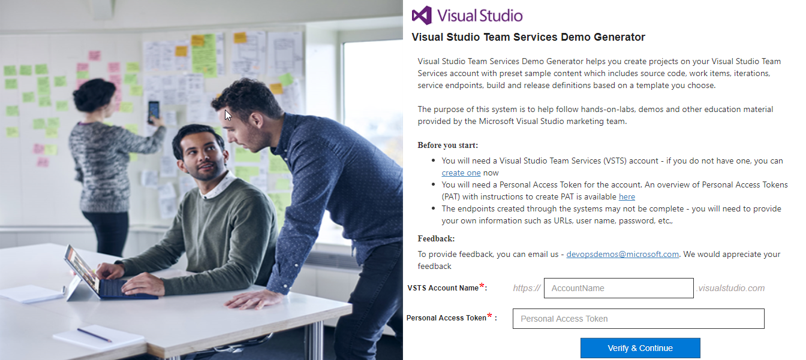
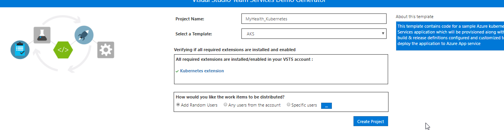
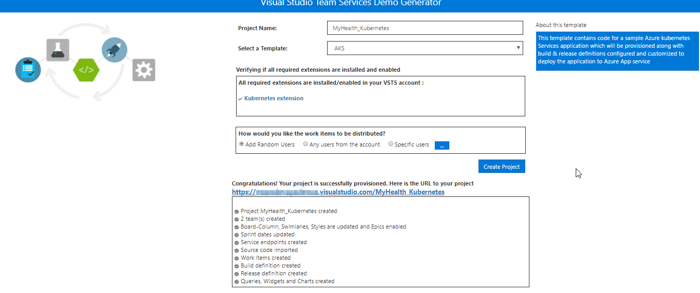

# CI/CD with VSTS


This lab outlines the process to compile a Docker-based ASP.NET Core web application and deploy it to a **Kubernetes** cluster running on **Azure Container Service (AKS)** using the **Visual Studio Team Services (VSTS)**.

# What's covered in this lab

In this lab, the following tasks will be performed:

* Create an Azure SQL server

* Provision the VSTS Team Project with a .NET Core application using the [VSTS Demo Generator](https://vstsdemogenerator.azurewebsites.net/?Name=aks&templateId=77372){:target="_blank"} tool

* Configure endpoints (properties) in VSTS to access Azure and AKS

* Configure application and database deployment using Continuous Deployment (CD) in VSTS

* Modify database connection string & ACR configuration in the source code

* Initiate the build to automatically deploy the application

# Lab Flow

* Firstly, the source code changes are committed to the VSTS git repository

* VSTS will create the custom Docker image **myhealth.web** and push the image tagged with the build ID to the ACR. Subsequently it will publish the [Kubernetes deployment YAML file](https://kubernetes.io/docs/concepts/workloads/controllers/deployment/) as a build artifact.

* VSTS will deploy **mhc-front** and **mhc-back** services into the Kubernetes cluster using the YAML file.

  **mhc-front** is the application hosted on a load balancer whereas **mhc-back** is the [Redis](https://redis.io/) Cache

* The Kubernetes cluster will then pull the **myhealth.web** image from the ACR into the [Pods](https://kubernetes.io/docs/concepts/workloads/pods/pod/) and complete the deployment file instructions

* The myhealth.web application will be accessible through a browser, once the deployment is successfully completed

# Prerequisites for the lab

1. You will need a **Visual Studio Team Services Account**. If you do not have one, you can sign up for free [here](https://www.visualstudio.com/products/visual-studio-team-services-vs)

2. You will need a **Personal Access Token** to set up your project using the VSTS Demo Generator. Please see this [article](https://docs.microsoft.com/en-us/vsts/accounts/use-personal-access-tokens-to-authenticate) for instructions to create your token.

    {"You should treat Personal Access Tokens like passwords. It is recommended that you save them somewhere safe so that you can re-use them for future requests." %}

3. **Kubernetes extension** from [Visual Studio Marketplace](https://marketplace.visualstudio.com/items?itemName=tsuyoshiushio.k8s-endpoint) installed to the VSTS account


## Setting up the VSTS team project

1. Use the [VSTS Demo Generator](https://vstsdemogenerator.azurewebsites.net/?Name=aks&templateId=77372) to provision the project on your VSTS account.

   > **VSTS Demo Generator** helps you create the team projects on your VSTS account with sample content that include source code, work items, iterations, service endpoints, build and release definitions based on the template you choose during the configuration.

    

2. Provide the Project Name, and click on the **Create Project** button.

   

3. Once the project is provisioned, click on the link displayed under the **URL** field to navigate to the team project.

   
   

## Exercise 1: Service Endpoint creation

Service endpoints are a bundle of properties securely stored by the VSTS and is a way for VSTS to connect to the external systems or services.

Since the connections are not established during project provisioning,the two endpoints - **Azure Resource Manager** and **Kubernetes** need to be created manually.

1. **Azure Resource Manager Service Endpoint**: Defines and secures a connection to a Microsoft Azure subscription using Service Principal Authentication (SPA).

   * In the VSTS, navigate to the **Services** by clicking on the gear icon , and click on the **+ New Service Endpoint** button. Select the **Azure Resource Manager** and specify the **Connection name**, select the **Subscription** from the dropdown. Leave Resource Group name blank and click on the **OK** button. This endpoint will be used to connect the **VSTS** and the **Azure**.

     You will be prompted to authorize this connection with Azure credentials. Disable pop-up blocker in your browser if you see a blank screen after clicking the OK button, and retry the step.


2. **Kubernetes Service Endpoint**

   * Click the **+ New Service Endpoint** button, and select **Kubernetes** from the list. We can use this endpoint to connect the **VSTS** and the **Azure Container Service (AKS)**.

     * **Connection Name**: Provide the connection name.

     * **Server URL**: Provide the container service address in the format `http://{API server address}`

     * **Kubeconfig**: To get the Kubeconfig value, run the following Azure commands in a Putty session opened for the CentOS VM

      1. Type **az login** in the command prompt and hit Enter. Authorize your login by accessing the url given in the prompt and enter the provided unique code to complete the authentication.

      2. Type **az aks get-credentials --resource-group yourResourceGroup --name yourAKSname** in the command prompt to get the access credentials for the Kubernetes cluster.

     * Navigate to the **.kube** folder under your home directory (eg: cd .kube/)
     
     * Execute below command to get Kube Config value
     
        ```
        [root@centosjumpbox .kube]# cat config
        {apiVersion: v1, clusters: [{cluster: {certificate-authority-data: LS0tLS1CRUdJTiBDRVJUSUZJQ0FURS0tLS0t.....
        ............................................................................................................
               token: 711e57a22410bb8d06ea956d2d5bc310}}]}
        ```

     * Copy the contents of the **config** file and paste it in the Kubernetes Connection window. Click the  **OK** button.

       
