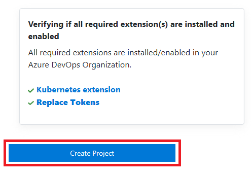
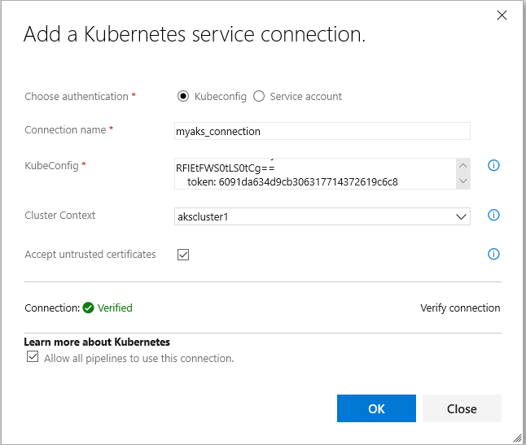
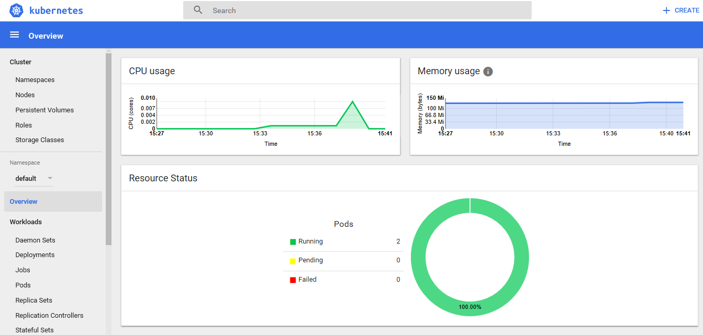

# CI/CD with Azure DevOps


This lab outlines the process to compile a Docker-based ASP.NET Core web application and deploy it to a **Kubernetes** cluster running on **Azure Container Service (AKS)** using the **Visual Studio Team Services (VSTS)**.

## What's covered in this lab

In this lab, the following tasks will be performed:

* Create an Azure SQL server

* Provision the VSTS Team Project with a .NET Core application using the [VSTS Demo Generator](https://vstsdemogenerator.azurewebsites.net/?Name=aks&templateId=77372) tool

* Configure endpoints (properties) in VSTS to access Azure and exisiting AKS cluster

* Configure application and database deployment using Continuous Deployment (CD) in VSTS

* Modify database connection string & ACR configuration in the source code

* Initiate the build to automatically deploy the application

## Lab flow

* Firstly, the source code changes are committed to the VSTS git repository

* VSTS will create the custom Docker image **myhealth.web** and push the image tagged with the build ID to the ACR. Subsequently it will publish the [Kubernetes deployment YAML file](https://kubernetes.io/docs/concepts/workloads/controllers/deployment/) as a build artifact.

* VSTS will deploy **mhc-front** and **mhc-back** services into the Kubernetes cluster using the YAML file.

  **mhc-front** is the application hosted on a load balancer whereas **mhc-back** is the [Redis](https://redis.io/) Cache

* The Kubernetes cluster will then pull the **myhealth.web** image from the ACR into the [Pods](https://kubernetes.io/docs/concepts/workloads/pods/pod/) and complete the deployment file instructions

* The myhealth.web application will be accessible through a browser, once the deployment is successfully completed

## Prerequisites for the lab

1. **Kubernetes extension** from [Visual Studio Marketplace](https://marketplace.visualstudio.com/items?itemName=tsuyoshiushio.k8s-endpoint) installed to the VSTS account

2. You will need a **Azure SQL Database**. Provision a new **Azure SQL Server and SQL Database** in **East US** region before proceeding with the below steps. Make note of the SQL Server name, database name, username and password. These will be used later in the exercise. 


### Setting up the VSTS team project

1. Use the [VSTS Demo Generator](https://vstsdemogenerator.azurewebsites.net/?Name=aks&templateId=77372) to provision the project on your VSTS account.

   > **VSTS Demo Generator** helps you create the team projects on your VSTS account with sample content that include source code, work items, iterations, service endpoints, build and release definitions based on the template you choose during the configuration.

   Click on 'Sign In' and accpet the Authorizations. 
   
   

2. Provide the Project Name, and click on the **Create Project** button.

   

3. Once the project is provisioned, click on the link displayed under the **URL** field to navigate to the team project.

   
   

#### Exercise 1: Service Endpoint creation

Service endpoints are a bundle of properties securely stored by the VSTS and is a way for VSTS to connect to the external systems or services.

Since the connections are not established during project provisioning,the two endpoints - **Azure Resource Manager** and **Kubernetes** need to be created manually.

1. **Azure Resource Manager Service Endpoint**: Defines and secures a connection to a Microsoft Azure subscription using Service Principal Authentication (SPA).

   * In the VSTS, navigate to the **Services** by clicking on the gear icon, and click on the **+ New Service Connection** button. Select the **Azure Resource Manager** and specify the **Connection name**, select the **Subscription** from the dropdown. Leave Resource Group name blank and click on the **OK** button. This endpoint will be used to connect the **VSTS** and the **Azure**.

     You will be prompted to authorize this connection with Azure credentials. Disable pop-up blocker in your browser if you see a blank screen after clicking the OK button, and retry the step.


2. **Kubernetes Service Endpoint**

   * Click the **+ New Service Connection** button, and select **Kubernetes** from the list. We can use this endpoint to connect the **VSTS** and the **Azure Kubernetes Service (AKS)**.

     * **Connection Name**: Provide the connection name.

     * **Server URL**: Provide the container service address in the format `https://{API server address}`. API Server address can be found in the Overview blade of AKS in Azure Portal.

     * **Kubeconfig**: To get the Kubeconfig value, run the following Azure commands in a Putty session opened for the CentOS VM

      1. Type **az login** in the command prompt and hit Enter. Authorize your login by accessing the url given in the prompt and enter the provided unique code to complete the authentication.

      2. Type **az aks get-credentials --resource-group yourResourceGroup --name yourAKSname** in the command prompt to get the access credentials for the Kubernetes cluster.

     * Navigate to the **.kube** folder under your home directory (eg: cd .kube/)
     
     * Execute below command to get Kube Config value
     
        ```
        [root@centosjumpbox .kube]# cat config
        {apiVersion: v1, clusters: [{cluster: {certificate-authority-data: LS0tLS1CRUdJTiBDRVJUSUZJQ0FURS0tLS0t.....
        ............................................................................................................
               token: 711e57a22410bb8d06ea956d2d5bc310}}]}
        ```

     * Copy the contents of the **config** file and paste it in the Kubernetes Connection window. Check **Accept Untrusted Certificates. Click the  **Verify connection** button. Once connection succeeds click **Ok**.

       

#### Exercise 2: Configure Build and Release definitions

Now that the connections are established, we will manually map the existing Azure endpoint, AKS and Azure Container Registry to the build and release definitions.

1. Select the **Builds** section under the **Build and Release** hub and **Edit** the build definition **MyHealth.AKS.Build**.

   

2. Navigate to **Process** section under the **Tasks** tab. In the Phase1 section select **Run services**. Select the previously created endpoints from the dropdown for **Azure subscription**. Choose the **Azure Container Registry** which we had created in the previous exercises from the drop down for Azure Container Registry. Repeat the same for **Build services, Push services, and Lock Services Publish**. Click the **Save** option.

    
    
    
    |Tasks|Usage|
    |-----|-----|
    | **Run services**| prepares the suitable environment by restoring required packages|
    | **Build services**| builds the docker images specified in a **docker-compose.yml** file with registry-qualified names and additional tags such as **$(Build.BuildId)**|
    | **Push services**| pushes the docker images specified in a **docker-compose.yml** file, to the container registry|
    | **Publish Build Artifacts**| publishes the **myhealth.dacpac** file to VSTS|

3. Navigate to the **Releases** section under the **Build & Release** menu, click on **MyHealth.AKS** release definition. **Edit** the release definition **MyHealth.AKS.Release** and select **Tasks**.

   

   

4. In the **Dev** environment, under the **DB deployment** phase, update the **Azure Subscription** value from the dropdown for **Execute Azure SQL: DacpacTask** task.

    

5. In the **AKS deployment** phase, Under the **Create Deployments & Services in AKS** task, update the **Kubernetes Service Connection** value from the dropdown. Expand the **Secrets** section and update the parameters - **Azure subscription** and  **Azure Container Registry** with the endpoint components from the dropdown.

6. Repeat similar steps for **Update image in AKS** task. Click **Save** to save the release definition

    

    * **Create Deployments & Services in AKS** will create the deployments and services in AKS as per the configuration specified in **mhc-aks.yaml** file. The Pod, for the first time will pull the latest docker image.

    * **Update image in AKS** will pull the appropriate image corresponding to the BuildID from the repository specified, and deploys the docker image to the **mhc-front pod** running in AKS.

7. Click on the **Variables** section under the release definition, update **ACR** and **SQL server** values for **Process Variables** with the details noted earlier while configuring the environment. Click on the **Save** button.
 Also update the **DatabaseName** and the **SQLAdmin Login** and **Password** based on the values you provided while creating the Azure SQL Database.

   

#### Exercise 3: Update Connection String & ACR URL in the manifest file

We will update the database connection string for the .NET Core application and ACR URL in the manifest YAML file.

1. Click on the **Code** tab, and navigate to the below path `AKS/src/MyHealth.Web` to **edit** the file `appsettings.json`

   Scroll down to the line number **9** and provide the database server name as given in the step 7 of the previous exercise and manually update the **User ID** and **Password** based on the credentials you provided while creating the Azure SQL DB. Initial Catalog will be the database name. Click on the **Commit** button.

"\"DefaultConnection\": \"Server=YOUR_SQLSERVER_NAME.database.windows.net,1433;Initial Catalog=<Name>;Persist Security Info=False;User ID=<User ID>;Password=<Password>\""

   

2. Navigate to the `AKS` path to **edit** the file `mhc-aks.yaml`. This YAML manifest file contains configuration details of **deployments**,**services** and **pods** which will be deployed in Kubernetes.

   Scroll to the line number **93**. modify the value ```__ACR__``` with your **\<ACR Login server>.azurecr.io** which was noted earlier while setting up the environment. Also **add the ImagePullSecrets under spec section. Provide the secret key as mysecretkey** as seen below

```yaml
      imagePullSecrets:
        - name: mysecretkey
```


Click on the **Commit** button.

   

#### Exercise 4: Trigger a Build and deploy application

In this exercise, let us trigger a build manually and upon completion, an automatic deployment of the application will be triggered. Our application is designed to be deployed in the pod with the **load balancer** in the front-end and **Redis cache** in the back-end.

1. Click on the **Builds** section under the **Build and Release** tab, click on the build definition **MyHealth.AKS.Build** and then click on the **Queue new build...** button.

    

2. On the Queue Build for MyHealth.AKS.Build windows, click on **Queue**

3. Once the build process starts, navigate to the **Builds** tab. Click on the build number to see the build in progress.

    

    

3. The build will generate and push the docker image to ACR. After the build completes, you will see the build summary. To view the generated images in the Azure Portal, click on the **Azure Container Registry** and navigate to the **Repositories**.

    

4. Switch back to the VSTS portal. Click on the **Releases** section on the **Build & Releases** tab, and click on the latest release. Click on the **Logs** section to see the release summary.

    

    

5. Once the release is complete, open the putty session to the Cent OS VM and run the below command to see the pods running in AKS:

    `**kubectl get pods`

    

    The deployed web application is running in the displayed pods.

6. To access the application, run the below command. If you see that **External-IP** is pending, wait for sometime until an IP is assigned.

    `**kubectl get service mhc-front --watch`

    

7. Copy the **External-IP** and paste it in the browser and hit the Enter button to launch the application.

    

    **Access AKS through the browser**
    Type the below command in a command prompt from your base machine to access the AKS through the browser.

    `az aks browse --resource-group <yourResourceGroup> --name <yourAKSname>`

    

    **AKS Dashboard:**
    Once the AKS dashboard is launched, the following details will be displayed.

    

## Summary

AKS reduces the complexity and operational overhead of managing a Kubernetes cluster by offloading much of that responsibility to Azure. With the **Visual Studio Team Services** and **Azure Container Services (AKS)**, we can build DevOps for dockerized applications by leveraging docker capabilities enabled on VSTS Hosted Agents.

## Attribution:
Content originally created by Srivatsa, Sachin Raj and sriramdasbalaji et al. from [this](https://github.com/Microsoft/almvm/blob/master/labs/vstsextend/kubernetes) ALM Doc. Modified it to work with exisiting K8S cluster
