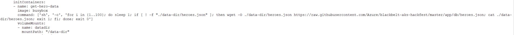
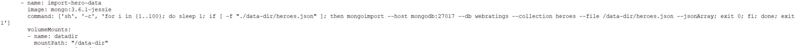

# Init Containers

This lab will show how to use Kubernetes Init Containers to run scripts and load data prior to the initialization of the primary container.

I'm not going to lie, things are going to get a little weird.

We are going to pull data from a remote source(Refer to initContainers section in init-web-api-sample.yaml):, and then populate the database(mongodb) from that source file. All before the primary container(api container) is initialized.

I told you it was going to be weird.


For reference, take a look at the Kubernetes.io docs on Init Containers [ by clicking here ](https://kubernetes.io/docs/concepts/workloads/pods/init-containers/)

## Download and pre-populate data with init containers

Take note of the two files in this directory, [init-db-sample.yaml](init-db-sample.yaml) and [init-web-api-sample.yaml](init-web-api-sample.yaml). We'll use these as our reference points for deployment.

 **Perform below steps in the Jumpbox**

1. Clear anything out of your cluster by deleting your deployments

    ```bash
    kubectl delete -f heroes-db.yaml
    kubectl delete -f heroes-web-api.yaml
    kubectl delete -f heroes-web-api-ingress.yaml
    ```

2. View the init-db-sample.yaml in the `helper-files` directory. We have the definitions to deploy the publically available the mongo db image

3. Deploy the db to your cluster with the db yaml
    ```bash
    cd ~/blackbelt-aks-hackfest/labs/helper-files

    kubectl create -f init-db-sample.yaml
    ```
4. Modify the init-web-api-sample.yaml to add your imagePullSecrets as well as reference your container registry and image, 

    > note that you only need to add your login info to the top level container(s) - the init containers pull from docker hubs public repo

    change
    ```yaml
          name:  heroes-api
        spec:
          containers:
          - image: sonofjorel/rating-api:v1
    ```

    to

    ```yaml
          name:  heroes-api
        spec:
          imagePullSecrets:
          - name: acr-secret
          containers:
            - image:  <login server>/azureworkshop/rating-api:v1
    ```

    and change
    ```yaml
          name:  heroes-web
        spec:
          containers:
          - image: sonofjorel/rating-web:v1
    ```

    to
    
    ```yaml
          name:  heroes-web
        spec:
          imagePullSecrets:
          - name: acr-secret
          containers:
            - image:  <login server>/azureworkshop/rating-web:v1
    ```
5. Look at the **initContainers** section in the **init-web-api-sample.yaml** file. In here we can see commands to download the data(heroes.json, sites.json, ratings.json) from the github repo to the **data-dir** folder.

   
   
   In the same section we can see shell commands to import data (heroes.json, sites.json, ratings.json) into the webratings database of mongodb. Unlike previous lab exercises where we ran **import.sh** inside the mongo db pod, here the data is imported by a init container. This ensures data is present in database well before the init container is initialized.
   
   

6. Deploy the web and api app to your cluster with the modified yaml
    ```bash
    kubectl create -f init-web-api-sample.yaml
    ```
    
7. See the init containers getting creating one after the other by executing the below command

    ```bash
    kubectl get pods --watch
    ```
    ```bash
    NAME                                READY     STATUS     RESTARTS   AGE
    heroes-api-deploy-cd5858bbc-k2qkh   0/1       Init:4/6   3          18s
    heroes-db-deploy-c8b656bf9-p7jb4    1/1       Running    0          2m
    heroes-web-deploy-d684ff8f6-ptrhd   1/1       Running    0          18s
    heroes-api-deploy-cd5858bbc-k2qkh   0/1       Init:5/6   3         18s
    heroes-api-deploy-cd5858bbc-k2qkh   0/1       Init:5/6   3         19s
    heroes-api-deploy-cd5858bbc-k2qkh   0/1       PodInitializing   0         20s
    heroes-api-deploy-cd5858bbc-k2qkh   1/1       Running   0         22s
    ```  
    Use Ctrl+C to exit 
    
 8. Lookup the available service "web"

    ```bash
    kubectl get services | grep web
    ```

    ```output
    NAME       TYPE             CLUSTER-IP     EXTERNAL-IP       PORT(S)            AGE
    web        LoadBalancer     10.0.125.16    13.68.178.31      8080:31707/TCP     25m
    ```
 
 9. Access the web app using it's EXTERNAL-IP on Port 8080 and see if it works as expected 


   ##### [Return back to BootCamp Table of Contents (Main Page)](/README.md)