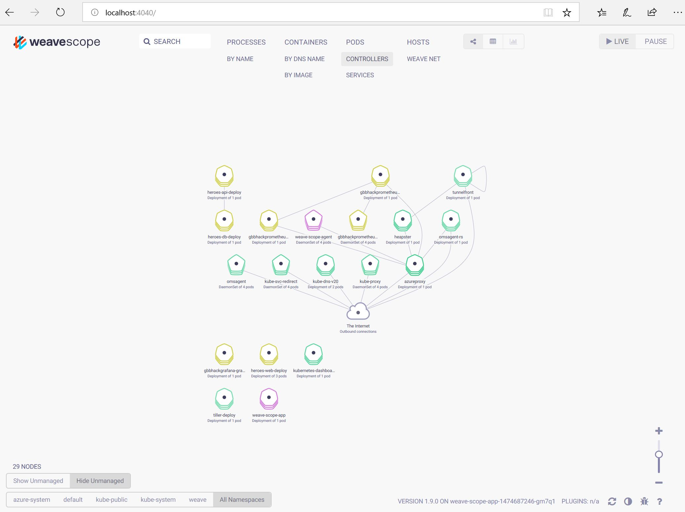

You can use [Weave](https://www.weave.works/) to display information about Pods, Deployments, Nodes, etc. 

1) Execute the following command in Azure Cloud Shell (Bash required) to deploy Weave
```azurecli-interactive
kubectl apply -f "https://cloud.weave.works/k8s/scope.yaml?k8s-version=$(kubectl version | base64 | tr -d '\n')"
```

2) Execute the following command on your local machine (Bash required) to forward Port 4040
```azurecli-interactive
kubectl port-forward -n weave "$(kubectl get -n weave pod --selector=weave-scope-component=app -o jsonpath='{.items..metadata.name}')" 4040
```

If you've no local bash available, use the Azure Cloud Shell to build the variables for step 1 and 2:
```azurecli-interactive
echo $(kubectl version | base64 | tr -d '\n')
Q2xpZW50IFZlcnNpb246IHZlcnNpb24uSW5mb3tNYWpvcjoiMSIsIE1pbm9yOiI5IiwgR2l0VmVyc2lvbjoidjEuOS4xIiwgR2l0Q29tbWl0OiIzYTFjOTQ0OWE5NTZiNjAyNmYwNzVmYTMxMzRmZjkyZjdkNTVmODEyIiwgR2l0VHJlZVN0YXRlOiJjbGVhbiIsIEJ1aWxkRGF0ZToiMjAxOC0wMS0wNFQxMTo1MjoyM1oiLCBHb1ZlcnNpb246ImdvMS45LjIiLCBDb21waWxlcjoiZ2MiLCBQbGF0Zm9ybToibGludXgvYW1kNjQifQpTZXJ2ZXIgVmVyc2lvbjogdmVyc2lvbi5JbmZve01ham9yOiIxIiwgTWlub3I6IjciLCBHaXRWZXJzaW9uOiJ2MS43LjkiLCBHaXRDb21taXQ6IjE5ZmU5MTkyM2Q1ODRjMzBiZDZkYjVjNWEyMWU5ZjBkNWY3NDJkZTgiLCBHaXRUcmVlU3RhdGU6ImNsZWFuIiwgQnVpbGREYXRlOiIyMDE3LTEwLTE5VDE2OjU1OjA2WiIsIEdvVmVyc2lvbjoiZ28xLjguMyIsIENvbXBpbGVyOiJnYyIsIFBsYXRmb3JtOiJsaW51eC9hbWQ2NCJ9Cg==

echo $(kubectl get -n weave pod --selector=weave-scope-component=app -o jsonpath='{.items..metadata.name}')
weave-scope-app-1474687246-gm7q1
```

3) Open browser using the following URL
```
http://127.0.0.1:4040
```


