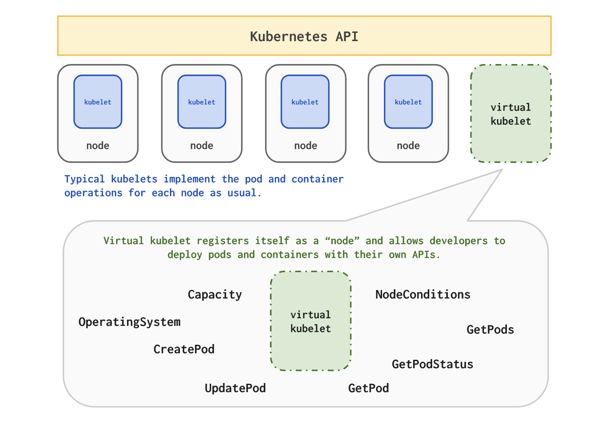

# Virtual-Kubelet and Azure Container Instances

Virtual Kubelet is an open source Kubernetes kubelet implementation that masquerades as a kubelet for the purposes of connecting Kubernetes to other APIs. This allows the nodes to be backed by other services like ACI, Hyper.sh, AWS, etc. This connector features a pluggable architecture and direct use of Kubernetes primitives, making it much easier to build on.

## Prerequisites
 * This Lab requires [Lab 8](/labs/day1-labs/08-migrate-mongo-to-cosmos.md
) "Migrate Data from MongoDB to Azure Cosmos DB" to be completed first.

## How It Works

The diagram below illustrates how Virtual-Kubelet works.



## Cluster Setup

1. List your Azure subscriptions:
    ```console
    az account list -o table
    ```
2. Copy your subscription ID and save it in an environment variable:

    **Bash**
    ```console
    export AZURE_SUBSCRIPTION_ID="<SubscriptionId>"
    ```

### Create a Resource Group for ACI

To use Azure Container Instances, you must provide a resource group. We will use the existing Resource Group you were assigned.

```console
az group list
```
Output:
```
[
    {
        "id": "/subscriptions/b23accae-e655-44e6-a08d-85fb5f1bb854/resourceGroups/ODL-aks-v2-gbb-8386",
        "location": "centralus",
        "managedBy": null,
        "name": "ODL-aks-v2-gbb-8386",
        "properties": {
        "provisioningState": "Succeeded"
        },
        "tags": {
        "AttendeeId": "8391",
        "LaunchId": "486",
        "LaunchType": "ODL",
        "TemplateId": "1153"
        }
    }
    ]
```

Copy the name from the results above and set to a variable:
```
export AZURE_RG=<name>
```

### Assign Service Principal credentials to Environment Variables

A Service Principal creates an identity for the Virtual Kubelet ACI provider to use when provisioning
resources on your account on behalf of Kubernetes.

a. In the console run
```console
az ad sp create-for-rbac --name virtual-kubelet-<randomized letters> -o table
```

b. The output should come as a tabular output similar to the following:
```output
    AppId                                 DisplayName          Name                        Password                                 Tenant
    ------------------------------------  -------------------  --------------------------  ------------------------------------  ------------------------------------
    e086ee4e-35cc-4fdd-9249-766756a1687c  virtual-kubelet-ejv  http://virtual-kubelet-ejv  133b6218-8bbe-4f0d-a824-660c17e87d2e  72f988bf-86f1-41af-91ab-2d7cd011db47
```

c. Assign the AppId, Tenant and Password to the Environment variables:
```console
export AZURE_TENANT_ID=<Tenant>
export AZURE_CLIENT_ID=<AppId>
export AZURE_CLIENT_SECRET=<Password>
```

## Deployment of the ACI provider in your cluster

Run these commands to deploy the virtual kubelet which connects your Kubernetes cluster to Azure Container Instances.

If your cluster is an AKS cluster:

```console
export VK_IMAGE_TAG=0.2-beta-9

cd ~
git clone https://github.com/virtual-kubelet/virtual-kubelet.git
cd virtual-kubelet

curl https://raw.githubusercontent.com/virtual-kubelet/virtual-kubelet/master/scripts/createCertAndKey.sh > createCertAndKey.sh
chmod +x createCertAndKey.sh
. ./createCertAndKey.sh

export ACI_REGION=eastus
export RELEASE_NAME=virtual-kubelet-east
export NODE_NAME=virtual-kubelet-east
```
Verify that the last three variables have been recorded correctly:
```console
echo $ACI_REGION,$RELEASE_NAME,$NODE_NAME
```
Output:
```output
eastus,virtual-kubelet-east,virtual-kubelet-east
```
Now intsall the Helm package for Virtual Kubelet:
```console
helm install ~/virtual-kubelet/charts/virtual-kubelet-for-aks/  --name "$RELEASE_NAME" \
    --set env.azureClientId="$AZURE_CLIENT_ID",env.azureClientKey="$AZURE_CLIENT_SECRET",env.azureTenantId="$AZURE_TENANT_ID",env.azureSubscriptionId="$AZURE_SUBSCRIPTION_ID",env.aciResourceGroup="$AZURE_RG",env.nodeName="$NODE_NAME",env.nodeOsType=Linux,env.apiserverCert=$cert,env.apiserverKey=$key,image.tag="$VK_IMAGE_TAG"
```

Output:

```console
NAME:   virtual-kubelet
LAST DEPLOYED: Thu Feb 15 13:17:01 2018
NAMESPACE: default
STATUS: DEPLOYED

RESOURCES:
==> v1/Secret
NAME                             TYPE    DATA  AGE
virtual-kubelet-virtual-kubelet  Opaque  3     1s

==> v1beta1/Deployment
NAME                             DESIRED  CURRENT  UP-TO-DATE  AVAILABLE  AGE
virtual-kubelet-virtual-kubelet  1        1        1           0          1s

==> v1/Pod(related)
NAME                                              READY  STATUS             RESTARTS  AGE
virtual-kubelet-virtual-kubelet-7bcf5dc749-6mvgp  0/1    ContainerCreating  0         1s


NOTES:
The virtual kubelet is getting deployed on your cluster.

To verify that virtual kubelet has started, run:

  kubectl --namespace=default get pods -l "app=virtual-kubelet-virtual-kubelet"
```

Deploy another virtual kubelet to West US
```console
export ACI_REGION=westus
export RELEASE_NAME=virtual-kubelet-west
export NODE_NAME=virtual-kubelet-west
```
Verify that the last three variables have been recorded correctly:
```console
echo $ACI_REGION,$RELEASE_NAME,$NODE_NAME
```
Output:
```output
westus,virtual-kubelet-west,virtual-kubelet-west
```
Now intsall the Helm package for Virtual Kubelet:
```console
helm install ~/virtual-kubelet/charts/virtual-kubelet-for-aks/  --name "$RELEASE_NAME" \
    --set env.azureClientId="$AZURE_CLIENT_ID",env.azureClientKey="$AZURE_CLIENT_SECRET",env.azureTenantId="$AZURE_TENANT_ID",env.azureSubscriptionId="$AZURE_SUBSCRIPTION_ID",env.aciResourceGroup="$AZURE_RG",env.nodeName="$NODE_NAME",env.nodeOsType=Linux,env.apiserverCert=$cert,env.apiserverKey=$key,image.tag="$VK_IMAGE_TAG"
```

Output:

```console
NAME:   virtual-kubelet
LAST DEPLOYED: Thu Feb 15 13:17:01 2018
NAMESPACE: default
STATUS: DEPLOYED

RESOURCES:
==> v1/Secret
NAME                             TYPE    DATA  AGE
virtual-kubelet-virtual-kubelet  Opaque  3     1s

==> v1beta1/Deployment
NAME                             DESIRED  CURRENT  UP-TO-DATE  AVAILABLE  AGE
virtual-kubelet-virtual-kubelet  1        1        1           0          1s

==> v1/Pod(related)
NAME                                              READY  STATUS             RESTARTS  AGE
virtual-kubelet-virtual-kubelet-7bcf5dc749-6mvgp  0/1    ContainerCreating  0         1s


NOTES:
The virtual kubelet is getting deployed on your cluster.

To verify that virtual kubelet has started, run:

  kubectl --namespace=default get pods -l "app=virtual-kubelet-virtual-kubelet"
```

## Validate the Virtual Kubelet ACI provider

To validate that the Virtual Kubelet has been installed, return a list of Kubernetes nodes using the [kubectl get nodes][kubectl-get] command. You should see a node that matches the name given to the ACI connector.

```azurecli-interactive
kubectl get nodes
```

Output:

```console
NAME                                        STATUS    ROLES     AGE       VERSION
virtual-kubelet-east                        Ready     <none>    2m        v1.8.3
virtual-kubelet-west                        Ready     <none>    2m        v1.8.3
aks-nodepool1-39289454-0                    Ready     agent     22h       v1.7.7
aks-nodepool1-39289454-1                    Ready     agent     22h       v1.7.7
aks-nodepool1-39289454-2                    Ready     agent     22h       v1.7.7
```

## Schedule a pod in ACI

We will use a nodeName constraint to force the scheduler to schedule the pod to the new virtual-kubelet-east node. The yaml file is included in `~/blackbelt-aks-hackfest/labs/helper-files/east-aci-heroes.yaml`. Edit the file to point to your Azure Container Registry, edit the dnsnamelabel to add your lab number and have your CosmosDB MongoDb connection String:

```yaml
apiVersion: v1
kind: Pod
metadata:
  name: heroes-east
  labels:
    name:  heroes-east
  annotations:
    virtualkubelet.io/dnsnamelabel: "heroes-xxxxxx"
spec:
  imagePullSecrets:
    - name: acr-secret
  containers:
  - image: <login_server>.azurecr.io/azureworkshop/rating-web:v1
    imagePullPolicy: Always
    name: ratings-web
    resources:
      requests:
        memory: 1G
        cpu: 1
    env:
    - name:  API
      value:  http://localhost:3000/
    - name: KUBE_NODE_NAME
      value: "East US"
    ports:
    - containerPort: 8080
      name: http-web
      protocol: TCP
  - image: <login_server>.azurecr.io/azureworkshop/rating-api:v1
    imagePullPolicy: Always
    name: ratings-api
    resources:
      requests:
        memory: 1G
        cpu: 1
    env:
    - name:  MONGODB_URI
      value:  <value from lab#8>
    ports:
    - containerPort: 3000
      name: http-api
      protocol: TCP
  dnsPolicy: ClusterFirst
  nodeName: virtual-kubelet-east
  ```

  ```console
  cd ~
  cd blackbelt-aks-hackfest/labs/helper-files
  kubectl apply -f east-aci-heroes.yaml 
  ```

  Then deploy another pod to the new virtual-kubelet-west node. The yaml file is included in `~/blackbelt-aks-hackfest/labs/helper-files/west-aci-heroes.yaml`. Edit the file to point to your Azure Container Registry, edit the dnsnamelabel to add your lab number and have your CosmosDB MongoDb connection String:

  ```yaml
apiVersion: v1
kind: Pod
metadata:
  name: heroes-west
  labels:
    name:  heroes-west
  annotations:
    virtualkubelet.io/dnsnamelabel: "heroes-xxxxx"
spec:
  imagePullSecrets:
    - name: acr-secret
  containers:
  - image: <login_server>.azurecr.io/azureworkshop/rating-web:v1
    imagePullPolicy: Always
    name: ratings-web
    resources:
      requests:
        memory: 1G
        cpu: 1
    env:
    - name:  API
      value:  http://localhost:3000/
    - name: KUBE_NODE_NAME
      value: "West US"
    ports:
    - containerPort: 8080
      name: http-web
      protocol: TCP
  - image: <login_server>.azurecr.io/azureworkshop/rating-api:v1
    imagePullPolicy: Always
    name: ratings-api
    resources:
      requests:
        memory: 1G
        cpu: 1
    env:
    - name:  MONGODB_URI
      value:  <value from lab#8>
    ports:
    - containerPort: 3000
      name: http-api
      protocol: TCP
  dnsPolicy: ClusterFirst
  nodeName: virtual-kubelet-west
```

```console
kubectl apply -f west-aci-heroes.yaml
```
# Set up Azure Traffic Manager Policies to Load Balance between ACI Instances

## Determine the FQDN of the ACI Instances

By placing the annotation for a DNSlabel ACI will receive an Azure assigned FQDN. The pattern that ACi uses is the Kubernetes dnsLabelName.azureregion.azurecontainer.io To determine the FQDN of your ACi instance run the following commands:

```console
az container show -g $AZURE_RG -n default-heroes-east --query ipAddress.fqdn
az container show -g $AZURE_RG -n default-heroes-west --query ipAddress.fqdn
```

The instances should have the FQDN of:

```output
heroes-14787.eastus.azurecontainer.io
heroes-14787.westus.azurecontainer.io
```

# Create a Traffic Manager profile in the Azure Portal

Microsoft Azure Traffic Manager allows you to control the distribution of user traffic for service endpoints in different datacenters. Service endpoints supported by Traffic Manager include Azure VMs, Web Apps, and cloud services. You can also use Traffic Manager with external, non-Azure endpoints.

Traffic Manager uses the Domain Name System (DNS) to direct client requests to the most appropriate endpoint based on a traffic-routing method and the health of the endpoints. Traffic Manager provides a range of traffic-routing methods and endpoint monitoring options to suit different application needs and automatic failover models. Traffic Manager is resilient to failure, including the failure of an entire Azure region.

## Create the Traffic Manager Profile

1. Create a Traffic Manager profile giving the main FQDN a unique label such as heroes-<your_lab_number>:

```console
az network traffic-manager profile create --name vk-aci-aks-tm --resource-group $AZURE_RG --routing-method Performance --unique-dns-name heroes-xxxxxx --monitor-port 8080
```

2. Now create an endpoint for both the east and west ACI instances, using their DNS FQDN you discovered in the previous exercise

```console
az network traffic-manager endpoint create --name heroes-east --resource-group $AZURE_RG --profile-name vk-aci-aks-tm --type externalEndpoints --endpoint-location eastus --endpoint-status enabled --target heroes-177502.eastus.azurecontainer.io

az network traffic-manager endpoint create --name heroes-west --resource-group $AZURE_RG --profile-name vk-aci-aks-tm --type externalEndpoints --endpoint-location westus --endpoint-status enabled --target heroes-177502.westus.azurecontainer.io
```

3. Verify that the endpoint monitor status has become online:
```console
az network traffic-manager endpoint show --name heroes-east --resource-group $AZURE_RG --profile-name vk-aci-aks-tm --type externalEndpoints -o table

az network traffic-manager endpoint show --name heroes-west --resource-group $AZURE_RG --profile-name vk-aci-aks-tm --type externalEndpoints -o table
```

The output should be similar to the below:
```output
EndpointLocation    EndpointMonitorStatus    EndpointStatus    Name           Priority  ResourceGroup    Target                             Weight
------------------  -----------------------  ----------------  -----------  ----------  ---------------  -------------------------------  --------
East US             Online                   Enabled           heroes-east           1  vk-aci-aks-tm       heroes.eastus.azurecontainer.io         1
```

4. Now test in your browser using the url http://heroes-xxxxxx.trafficmanager.net:8080 and the Super Heroes voting page should load. In the footer of the page it will either say East US or West US based upon performance routing using Traffic Manager.
