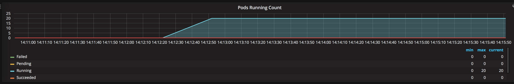

# Working with Azure Kubernetes Service Cluster Scaling

Imagine a scenario where your realize that your existing cluster is at capacity and you need to scale it out to add more nodes in order to increase capacity and be able to deploy more PODS.

## Exercise 1 - Scale Application
1. Check to see current number of pods running via Grafana Dashboard.
* Go to the same Grafana Dashboard from exercise 8 and look at the **Pods Running Count** section. You will see the total count of Pods and the various phases they are in.



2. Check to see current number of heroes pods running via K8s CLI.
```bash
kubectl get pods | grep heroes
# You should see something like the following as output (one replica of each pod):
heroes-api-deploy-1165643395-fwjtm             1/1       Running   0          2d
heroes-db-deploy-839157328-4656j               1/1       Running   0          2d
heroes-web-1677855039-8t57k                    1/1       Running   0          2d
```
3. Scale # Web Pods
* To simulate a real-world scenario we are going to scale the application.
```bash
# This command will create multiple replicas of the heroes-web pod to simulate additional load on the cluster.
kubectl scale deploy/heroes-web --replicas=20
```
4. Check to see number of pods now running via Grafana Dashboard.


5. Check to see number of heroes pods running via K8s CLI.
```bash
kubectl get svc | grep heroes
# You should see something like the following as output (more than one heroes-web pod and some of them in different states):
heroes-api-deploy-1165643395-fwjtm             1/1       Running             0          2d
heroes-db-deploy-839157328-4656j               1/1       Running             0          2d
heroes-web-1677855039-0dgk3                    0/1       Pending             0          11s
heroes-web-1677855039-0j5qp                    0/1       Pending             0          10s
heroes-web-1677855039-0lp93                    0/1       Pending             0          8s
heroes-web-1677855039-116sv                    0/1       Pending             0          11s
```
6. Check up on Pods Running in Grafana dashboard.
* As you can see we have a number of pods that are in the pending state which means they are trying to be scheduled to run. In this scenario the cluster is out of capacity so they are not able to be scheduled.


## Exercise 2 - Scale K8s Cluster
1. Check to see number of current nodes running.
```bash
kubectl get nodes
# You should see something like the following as output (there is one node in the cluster):
NAME                       STATUS    ROLES     AGE       VERSION
aks-nodepool1-29249874-0   Ready     agent     22h       v1.8.1
```
2. Add another node to the cluster.
```bash
az aks scale -g <RESOURCE_GROUP_NAME> -n <AKS_CLUSTER_NAME> --node-count 2
```
3. Check to see number of nodes has increased or decreased.
```bash
kubectl get nodes
# You should see something like the following as output (there are now two nodes in the cluster):
NAME                       STATUS    ROLES     AGE       VERSION
aks-nodepool1-29249874-0   Ready     agent     22h       v1.8.1
aks-nodepool1-29249874-1   Ready     agent     30s       v1.8.1
```
4. Re-visit Grafana Dasboard to validate cluster scale is working.
* Take a look at hte **Pods Pending Count** again and you should see that after a few minutes the number of pending pods is going down.


You now have additional node capacity in your Azure Kubernetes Service cluster to be able to provision more PODS.