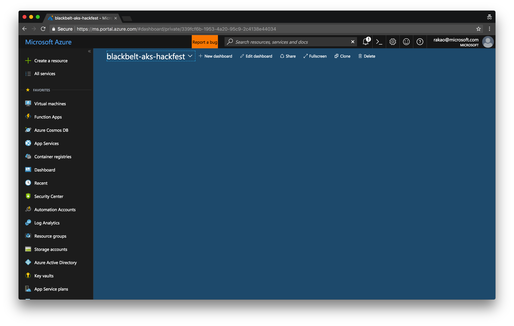

# Moving your data services to Hosted Data Solutions (CosmosDB)

In this section we will be creating a CosmosDB instance in your Azure account to migrate/export your MongoDB data to CosmosDB.  You can use CosmosDB as a drop in replacement for MongoDB, since CosmosDB uses a MongoDB compatibale API.  As such, you are only required to replace/change the MongoDB URI connection string with one supplied by CosmosDB in the dashboard. 

## 00 - Setup

You will need to prepare and setup your environment in order to move data from your MongoDB Server to CosmosDB.

### Creating a CosmosDB Service/Instance

You can create a CosmosDB service/instance in one (1) of two (2) ways:
1. Via the [Azure-CLI](https://docs.microsoft.com/en-us/cli/azure/install-azure-cli?view=azure-cli-latest) command line tool --**OR**--
2. Via the [Azure Web Portal](https://portal.azure.com)

#### Method 1: via Azure-CLI

The Azure-CLI Command Line Tool is available and supported for Windows, macOS and Linux. The following uses the cross plaform Azure-CLI in a Linux bash shell to deploy an instance of CosmosDB into your Azure Subscription/Account.

Note:
- We are leveraging Linux bash environment variables to script our deployment.  You should change **ALL** the values for each variable listed to fit your preferred deployment.  As an example ```location1``` and ```location2``` should be changed to your desired Azure datacentre.
- The ```\``` slashes in the below example are used for escaping new lines for readability purposes (they are not a requirement), as such you may remove them to form a single line command.

```
# !!!Set variables for the new account, database, and collection etc.!!!
resourceGroupName='someResourceGroupName'
location1='southcentralus'
location2='northcentralus'
name='someCosmosdbName'
databaseName='someDatabaseName'
collectionName='someCollectionName'

# Create a resource group
az group create \
	--name $resourceGroupName \
	--location $location1

# Create a MongoDB API Cosmos DB account
az cosmosdb create \
	--name $name \
	--kind MongoDB \
	--locations "$location1"=0 "$location2"=1 \
	--resource-group $resourceGroupName \
	--max-interval 10 \
	--max-staleness-prefix 200
```

Once you've run the above command, your CosmosDB instance will be provisioned within minutes.  When the deployment is sucessful you will see output in your terminal with information about your CosmosDB deployment.

#### Method 2: via Azure Web Portal

If you prefer a more visual and guided walk through for creating an Azure CosmosDB instance, the Azure Web Portal is your best option.  You will need to open a browser and enter the address ```https://portal.azure.com```.

Your portal should look something like the following image:



You will then need to navigate in the portal and do the following:

1. Click on ```Create a Resource``` in the top left corner of the portal
2. Type "azure cosmos db" in the ```search marketplace``` search field and select ```Azure Cosmos DB``` in the results
3. Click the blue ```Create``` button at the bottom of the new blade that appears


You will now be able to fill in a form to deploy your CosmosDB instance.

You will need to fill in the following information:

1. ```ID``` - The unique name to give to your Azure CosmosDB account
2. ```API```- The API to use to access your CosmosDB - this can be one of [```SQL```, ```MongoDB```, ```Cassandra```, ```Azure Table```, ```Gremlin```] and corresponds with the underlying data model types for each protocol.  We will choose ```MongoDB``` for this lab.
3. ```Subscription``` - If you have multiple Azure subscriptions/accounts you may choose which one to deploy to.
4. ```Resource Group```- The name of an exisiting or new resource group to deploy your CosmosDB instance into.  This helps to keep your resources organized (think of it as a logical naming space like a folder/directory).
5. ```Location``` - The Datacentre you wish to deploy to e.g. ```Canada Central```


Once you've clicked create, your CosmosDB instance will be provisioned within minutes.  You will be notified with an alert in the top right corner of your Portal Dashboard.

## 01 - Connecting to CosmosDB

In this section we will learn how to retrieve the CosmosDB connection string that is required in order to connect to your new database in Azure.  The connection string takes the format: ```mongodb://<username>:<password>@<cosmosdb-url>:10255/?ssl=true```.  The connection string is broken down into three important parts:

- ```<username>```: The username to connect to your instance, this is the same value as the name of your database
- ```<password>```: This is one of two auto generated 88 character hashed passwords provided for you.  You can regenerate/revoke a password when you need to.
- ```<cosmos-url>```: This is the CosmosDB url where your instance can be reached.  Typically it should follow the format ```<your-cosmosdb-name>.documents.azure.com

Note:
- Port number (```10255```) - CosmosDB does not use the standard MongoDB port of ```21017```
- SSL - this is on by default and is recommended when communicating to CosmosDB.  This is good practice and ensures your data is not sent in clear unencrypted text over the network.

### Method 1: via Azure-CLI

The simplest/quickest method for retrieving your CosmosDB Connection string is via the command line.  If you have the Azure-CLI installed you can simply run the following command, replacing ```<resource-group-name>``` and ```<cosmos-db-name>``` with the corresponding values for your CosmosDB instance.

```:bash
# !!!REPLACE <resource-group-name> and <cosmos-db-name> with your databases respective information!!!

az cosmosdb list-connection-strings -g <resource-group-name> -n <cosmos-db-name>
```

## 02 - Migrating Data From MongoDB to CosmosDB

In this section we will use the ```mongodump``` and ```mongorestore``` commands to export data from MongoDB and then import back into CosmosDB.  

The method used in this section is simple by design and may not be the right method for your production migrations.  We would recommend working with a MongoDB DBA and Architect who is experienced with MongoDB data migration in a production environment to minimize downtime.  Please refer to: [Guide for a successful migration
](https://docs.microsoft.com/en-us/azure/cosmos-db/mongodb-migrate#guide-for-a-successful-migration) in the Azure Docs for CosmosDB.

### Exporting data from MongoDB

Using the ```mongodump``` command you will do a full DB dump of your MongoDB server.  

**Note**: For Windows users you may need to run the command as ```mongodump.exe``` not ```mongodump``` AND in the same directory that the command is located in.

You will need to:
1. Name your backup - this will be used to create a new folder where your backup files will be saved to.
2. Choose a destination path in your local filesystem where your backup folder will be created in.

```:bash
mongodump -d <name-of-backup> -o <path-to-backup>
```

When this is complete, you should have at least 2 files - a ```.bson``` and ```.json``` file.  Both of these will be needed to restore the DB to CosmosDB.

### Importing data into CosmosDB

Using the ```mongorestore``` command you can do a full DB restore to your CosmosDB instance.

**Note**: For Windows users you may need to run the command as ```mongorestore.exe``` not ```mongorestore``` AND in the same directory that the command is located in.

You will need:
1. Your CosmosDB url (```<your-cosmosdb-name>.documents.azure.com```)
2. Your CosmosDB name - this is also your CosmosDB username
3. Your CosmosDB password - this is one of two 88 character hash strings you can find in the CosmosDB Azure Portal
4. The FULL path to your backup e.g. ```/full/path/to/your/name-of-backup```

```:bash
mongorestore --host <your-cosmosdb-url>:10255 -u <your-cosmosdb-name> -p <your-password> --db <your-cosmosdb-name> --ssl --sslAllowInvalidCertificates <full-path-to-backup>
```

When the restore is complete, you will see output pertaining to the restore.

## Exploring and using data

When the restore/import of your database is complete you can now connect to CosmosDB and access the data. 

### Via the Azure Portal

When you navigate to your CosmosDB instance in the Azure portal, you can view your Database, Collections and Documents by navigating to the "Data Explorer" section of your CosmosDB instance.  You can perform CRUD, Query and other operations on your database here as well.


### In your Application

CosmosDB instances which were setup using the MongoDB API (like our lab), are compatible with MongoDB drivers/APIs.  As such you can continue to use the SDK/API/Drivers that you are currently using in your application(s) and simply need to replace the old MongoDB connection string pointing to your old server, with the new connection string pointing to the new CosmosDB instance in Azure.

#### Environment Variable Example

If you are leveraging shell environment variables to reference the MongoDB URI connection string, all you will need to do is update this environment variable and all your applications leveraging this method to obtain the connection string will automatically benefit from the update.  

```:bash
# Linux Bash Shell Variables
# Replace the previous MongoDB connection string with the new CosmosDB connection string
MONGO_DBCONNECTION="mongodb://<username>:<password>@<cosmosdb-url>:10255/?ssl=true"
```

#### Hard Coded Connection Strings in Applications

If have hard coded the connection string value in your application, you will need to locate and replace the old MongoDB connection string value inside your application code with your new CosmosDB connection string value.  Instructions to find the new CosmosDB connection string value is found in the above "[Connecting To CosmosDB](#01---connecting-to-cosmosdb)" section.


```:javascript
// Node JS Example using Mongoose as the driver/ODM to a MongoDB backend
var mongoose = require('mongoose');

mongoose.connect('mongodb://<username>:<password>@<cosmosdb-url>:10255/?ssl=true');
```

**Note**: Some drivers/language environments/runtimes may require you to URI encode your password. CosmosDB uses an 88 character long hash for it's password and includes characters which may require you to URI encode it.  This is generally good practice.

```:javascript 
var mongoose = require('mongoose');
var password = "your-cosmosdb-88-character-long-password-hash";
password = encodeURIComponent(password);

mongoose.connect("mongodb://<username>:" + password + "@<cosmosdb-url>:10255/?ssl=true");
```